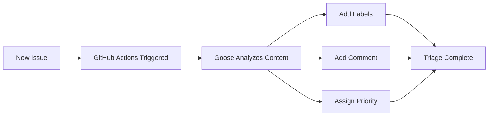

# 🤖 Feedback Triage System

An automated feedback triage system powered by **Goose AI** that automatically analyzes, categorizes, and labels GitHub issues.

## ✨ Features

- 🗂️ **Automatic Categorization** - Issues are automatically categorized (bug/feature/question/urgent)
- 🏷️ **Smart Labeling** - AI-powered label assignment based on content analysis
- 📊 **Priority Assignment** - Automatic priority levels (high/medium/low)
- 💬 **Helpful Comments** - Goose adds friendly, emoji-enhanced comments to each issue
- 👋 **Welcome Messages** - First-time contributors receive a warm welcome
- 📋 **Issue Templates** - Guided forms for different types of feedback

## 🚀 How It Works

1. **New Issue Created** → GitHub Actions workflow is triggered
2. **Goose Analyzes** → AI analyzes the issue content
3. **Labels Applied** → Appropriate labels are automatically added
4. **Comment Posted** → Helpful comment with emoji is added
5. **Triage Complete** → Issue is ready for team review

## 📋 Issue Types

We support three types of issues:

- 🐛 **Bug Report** - Report bugs or problems
- ✨ **Feature Request** - Suggest new features or enhancements
- 🎉 **Festival Feedback** - Share festival-related feedback

## 🏷️ Label System

### Categories
- `bug` - Something isn't working
- `feature` - New feature or request
- `question` - Further information is requested
- `urgent` - Requires immediate attention
- `documentation` - Improvements or additions to docs
- `festival-feedback` - Festival-specific feedback

### Priorities
- `priority: high` - Critical issues requiring immediate attention
- `priority: medium` - Important but not urgent
- `priority: low` - Nice to have, lower priority

### Status
- `needs-triage` - Waiting for initial triage
- `needs-review` - Requires team review
- `in-progress` - Currently being worked on
- `resolved` - Issue has been resolved

## 🔧 Setup Instructions

### Prerequisites
- GitHub account
- Goose CLI installed
- OpenRouter API key (or other LLM provider)

### Installation

1. **Fork/Clone this repository**
   ```bash
   git clone https://github.com/YourUsername/feedback-triage-system.git
   cd feedback-triage-system
   ```

2. **Set up GitHub Secrets**
   
   Go to your repository settings → Secrets and variables → Actions → New repository secret
   
   Add the following secret:
   - `OPENROUTER_API_KEY` - Your OpenRouter API key

   Note: `GITHUB_TOKEN` is automatically provided by GitHub Actions

3. **Enable GitHub Actions**
   
   Go to your repository → Actions tab → Enable workflows

4. **Create test issues**
   
   Go to Issues → New Issue → Choose a template

## 🧪 Testing the System

Create test issues using the provided templates:

1. Click "New Issue" in the Issues tab
2. Select an issue template
3. Fill out the form
4. Submit
5. Watch as Goose automatically triages it! 🎉

## 📊 Example Workflow

Here's what happens when you create an issue:



## 🎯 Use Cases

- **Festival Management** - Triage attendee feedback
- **Product Feedback** - Organize user suggestions
- **Bug Tracking** - Automatically categorize bug reports
- **Community Support** - Handle questions and issues
- **Event Planning** - Collect and organize event feedback

## 🛠️ Customization

### Modify Triage Logic

Edit `scripts/triage.sh` to customize:
- Analysis prompts
- Label criteria
- Priority rules
- Comment templates

### Add New Labels

Go to Issues → Labels → New Label to add custom labels

### Customize Templates

Edit files in `.github/ISSUE_TEMPLATE/` to modify issue templates

## 📈 Analytics

Track your feedback with GitHub's built-in tools:

- **Issues Dashboard** - View all issues at a glance
- **Labels Filter** - Filter by category, priority, status
- **Milestones** - Group issues by milestones
- **Projects** - Organize issues in kanban boards

## 🤝 Contributing

Contributions are welcome! Feel free to:

- Report bugs
- Suggest features
- Submit pull requests
- Improve documentation

## 📄 License

MIT License - feel free to use this for your own projects!

## 🙏 Acknowledgments

- Built with [Goose](https://github.com/block/goose) by Block
- Powered by AI for intelligent triage
- GitHub Actions for automation

## 📞 Support

Having issues? Create a new issue and our triage system will help! 😄

---

**Made with ❤️ and 🤖 AI**
